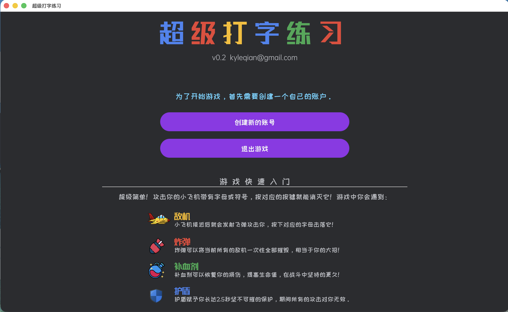
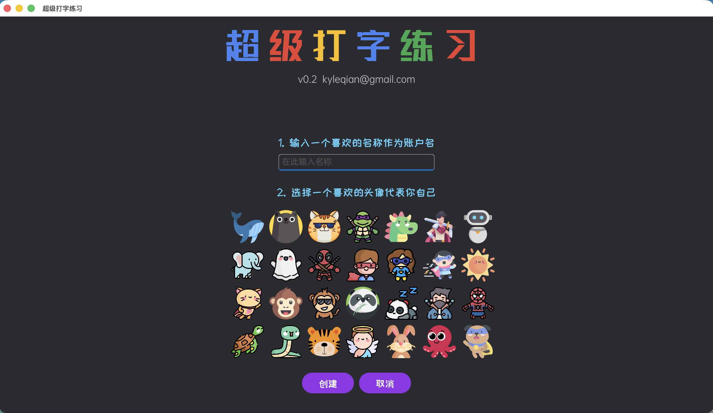
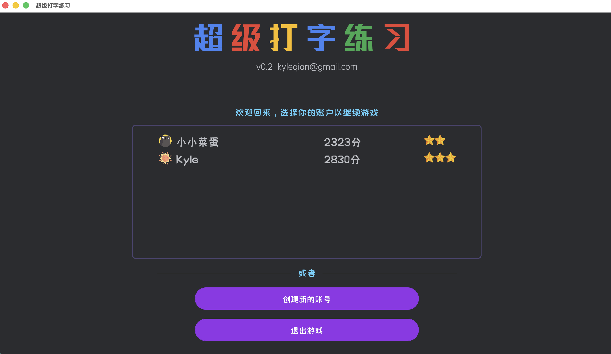
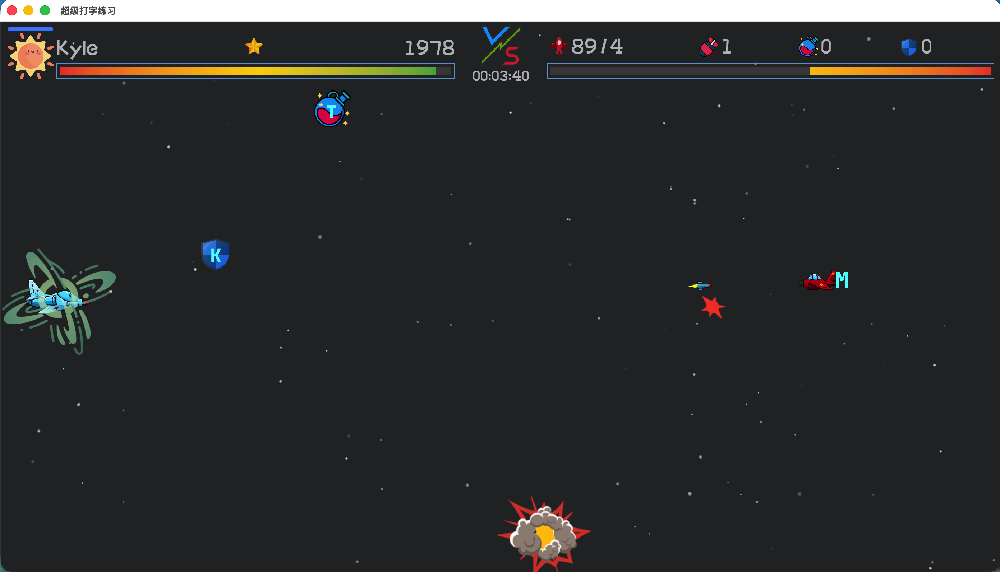

# 疯狂打字练习（xtyping）

🎮 一款为孩子设计的 **打字练习游戏**  
🧑‍💻 使用 Rust + Bevy 游戏引擎开发  
⌨️ 以“玩中学”为目标，帮助孩子快速熟悉键盘、掌握盲打

---

## ✨ 项目简介

**xtyping（疯狂打字练习）** 是一个基于Bevy游戏引擎开发的打字练习游戏，最初目的是给自家孩子练习键盘输入使用。

随着孩子从三年级开始学习计算机课程，熟悉键盘、学会盲打变得尤为重要。相比枯燥的重复输入练习，本项目通过**轻度游戏化**的方式，让孩子在“射击飞机”的过程中完成字符输入训练，在保证练习效果的同时，避免过度沉迷。

> 🎯 核心理念：  
> **以打字练习为主，游戏只是辅助激励手段**

---

## 🖼️ 游戏截图

<p align="center">
  
  
</p>

<p align="center">
  
  
  
</p>

---

## 🎯 游戏玩法

- 屏幕中会不断从右向左出现敌机
- 敌机上带有需要输入的 **字符或单词**
- 孩子通过 **在键盘上输入对应字符** 来发射导弹击毁敌机
- 全程以键盘输入练习打字为核心，不需要复杂操作，不需要控制飞机

### ⌨️ 实时速度调节
- ⬆️ 上箭头：提高游戏速度
- ⬇️ 下箭头：降低游戏速度  
  让孩子根据自身水平灵活调整节奏

---

## 🎚️ 难度系统

游戏内置 **5 个难度级别**，逐级递进：

| 难度 | 字符范围 | 速度 |
|----|----|----|
| Level 1 | 基础字母 | 慢 |
| Level 2 | 字母组合 | 较慢 |
| Level 3 | 常用字符 | 中等 |
| Level 4 | 扩展字符 | 较快 |
| Level 5 | 高级字符集 | 快 |

---

## 🧰 游戏道具

为了增加趣味性，同时避免挫败感，游戏加入了适度的道具系统：

- 💣 **炸弹**：直接发射多枚导弹清空当前屏幕上的所有敌机
- ❤️ **血包**：补充我方飞机的生命值
- 🛡️ **护盾**：我方飞机在一定时间内进入无敌状态

---

## 👾 Boss 战：英文句子挑战

- 每一关的最后都会出现一个 **太空战舰 Boss**
- Boss 需要通过 **逐词输入屏幕底部的英文句子** 来击毁
- 句子内容支持通过 **JSON 文件自定义**
    - 家长可自行添加适合孩子水平的英文内容
    - 非常适合结合英语学习使用

---

## 🖥️ 平台支持

xtyping 支持多个主流桌面平台：

- ✅ macOS
- ✅ Windows
- ✅ Linux
- ✅ 华为鸿蒙系统（HarmonyOS）

---

## 🛠️ 技术实现

- 🎮 游戏引擎：**Bevy**
- 🦀 编程语言：**Rust**
- 🧱 架构特点：
    - 跨平台
    - 原生性能
    - 无需依赖大型运行时

---

## 🚀 构建与运行
```bash
https://github.com/qianxiaoming/xtyping.git
cd xtyping
cargo build --release
./target/release/xtyping
```

---

## 👨‍👩‍👧 适用人群

- 小学生及打字初学者  
- 希望孩子练习键盘输入的家长  
- 对 Rust / Bevy 游戏开发感兴趣的开发者  

---

## 📄 许可证

本项目为个人开发项目，供学习和研究使用。  
如需用于教学或二次开发，欢迎交流与探讨。

> 如有正式开源需求，可自行补充 `LICENSE` 文件。

---

## ❤️ 致谢

- Rust 社区  
- Bevy 游戏引擎  
- 所有关注儿童计算机基础教育的人  

---